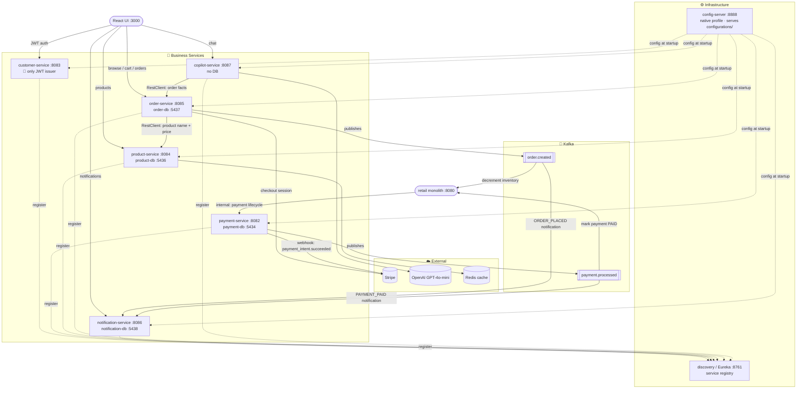

# Retail Microservices

[](https://github.com/suissitakwa/retail-microservices/actions/workflows/build.yml)

Spring Boot 4 / Java 21 microservices layer for the retail platform. These services run alongside (and progressively replace) the Spring Boot monolith at `../retail/`.

## Services

| Service | Port | DB Port | Status |
|---|---|---|---|
| config-server | 8888 | — | Infrastructure |
| discovery (Eureka) | 8761 | — | Infrastructure |
| customer-service | 8083 | 5435 | Auth + profiles — only JWT issuer |
| payment-service | 8082 | 5434 | Payment lifecycle + Kafka |
| product-service | 8084 | 5436 | Products, categories, inventory (Redis cached) |
| order-service | 8085 | 5437 | Cart, orders, Stripe checkout |
| notification-service | 8086 | 5438 | Kafka consumers, notification REST API |
| copilot-service | 8087 | — | OpenAI GPT-4o-mini assistant |

## Quick Start

### Prerequisites

- Java 21
- Docker + Docker Compose
- `.env` file in this directory (see below)

### Environment

Create `.env` in the repo root (never commit this):

```env
JWT_SECRET_KEY=...
STRIPE_SECRET_KEY=...
STRIPE_WEBHOOK_SECRET=...
OPENAI_API_KEY=...
APP_FRONTEND_BASE_URL=http://localhost:3000
```

### Run everything

```bash
docker-compose up
```

### Run infrastructure only (then start services with mvnw)

```bash
docker-compose up -d zookeeper kafka redis customer-db payment-db product-db order-db notification-db
```

Then start each service in order:

```bash
cd services/config-server    && ./mvnw spring-boot:run   # start first
cd services/discovery        && ./mvnw spring-boot:run   # start second
# then any order:
cd services/customer-service && ./mvnw spring-boot:run
cd services/product-service  && ./mvnw spring-boot:run
cd services/order-service    && ./mvnw spring-boot:run
cd services/notification-service && ./mvnw spring-boot:run
cd services/copilot-service  && ./mvnw spring-boot:run
```

## Architecture



### Tech Stack

- **Spring Boot 4.0.2** / **Java 21** / **Spring Cloud 2025.1.x**
- **Eureka** (service discovery) — all services register on startup
- **Config Server** (native profile) — serves `configurations/<service>.yml` to each service
- **Kafka** — async events between services
- **Redis** — product caching in product-service
- **RestClient** (Spring 6) — synchronous inter-service HTTP; no Feign

### JWT

`customer-service` is the **only** service that issues JWTs. All other services validate the token stateless (no DB call) — the role is embedded in the token claims as `[{authority: "ROLE_CUSTOMER"}]`.

### Kafka Event Flow

```
Order checkout
  → order-service publishes order.created
      → notification-service: saves ORDER_PLACED notification
      → retail monolith: decrements inventory

Stripe webhook (payment_intent.succeeded)
  → payment-service publishes payment.processed
      → notification-service: saves PAYMENT_PAID notification
      → retail monolith: marks payment PAID
```

### Service Ports Reference

| Service | Swagger UI |
|---|---|
| customer-service | http://localhost:8083/swagger-ui.html |
| product-service | http://localhost:8084/swagger-ui.html |
| order-service | http://localhost:8085/swagger-ui.html |
| notification-service | http://localhost:8086/swagger-ui.html |
| Eureka dashboard | http://localhost:8761 |
| Config server health | http://localhost:8888/actuator/health |
