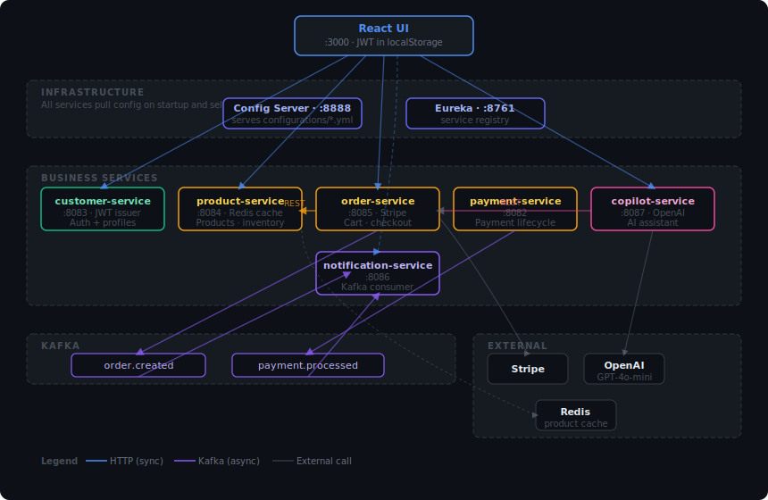
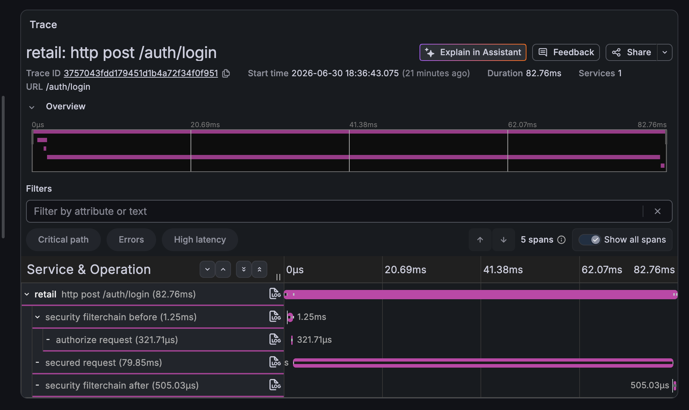

# Retail Microservices

[](https://github.com/suissitakwa/retail-microservices/actions/workflows/build.yml)

Spring Boot 4 / Java 21 microservices layer for the retail platform. These services run alongside (and progressively replace) the Spring Boot monolith at `../retail/`.

## Services

| Service | Port | DB Port | Purpose |
|---|---|---|---|
| config-server | 8888 | — | Infrastructure — serves config to all services |
| discovery (Eureka) | 8761 | — | Infrastructure — service registry |
| **api-gateway** | **8090** | — | **Single entry point — routes all client traffic** |
| customer-service | 8083 | 5435 | Auth + profiles — only JWT issuer |
| payment-service | 8082 | 5434 | Payment lifecycle + Kafka |
| product-service | 8084 | 5436 | Products, categories, inventory (Redis cached) |
| order-service | 8085 | 5437 | Cart, orders, Stripe checkout |
| notification-service | 8086 | 5438 | Kafka consumers, notification REST API |
| copilot-service | 8087 | — | OpenAI GPT-4o-mini assistant |

## Quick Start

### Prerequisites

- Java 21
- Docker + Docker Compose
- `.env` file in this directory (see below)

### Environment

Create `.env` in the repo root (never commit this):

```env
JWT_SECRET_KEY=...
STRIPE_SECRET_KEY=...
STRIPE_WEBHOOK_SECRET=...
OPENAI_API_KEY=...
MAIL_PASSWORD=re_...        # Resend API key — notification-service uses this for transactional email
APP_FRONTEND_BASE_URL=http://localhost:3000
```

### Run everything

```bash
docker-compose up
```

### Run infrastructure only (then start services with mvnw)

```bash
docker-compose up -d zookeeper kafka redis customer-db payment-db product-db order-db notification-db
```

Then start each service in order:

```bash
cd services/config-server    && ./mvnw spring-boot:run   # start first
cd services/discovery        && ./mvnw spring-boot:run   # start second
# then any order:
cd services/customer-service && ./mvnw spring-boot:run
cd services/product-service  && ./mvnw spring-boot:run
cd services/order-service    && ./mvnw spring-boot:run
cd services/notification-service && ./mvnw spring-boot:run
cd services/copilot-service  && ./mvnw spring-boot:run
cd services/api-gateway      && ./mvnw spring-boot:run   # after discovery
```

## Architecture



### Tech Stack

- **Spring Boot 4.0.2** / **Java 21** / **Spring Cloud 2025.1.x**
- **Eureka** (service discovery) — all services register on startup
- **Config Server** (native profile) — serves `configurations/<service>.yml` to each service
- **Kafka** — async events between services
- **Redis** — product caching in product-service
- **RestClient** (Spring 6) — synchronous inter-service HTTP; no Feign

### JWT

`customer-service` is the **only** service that issues JWTs. All other services validate the token stateless (no DB call) — the role is embedded in the token claims as `[{authority: "ROLE_CUSTOMER"}]`.

### Kafka Event Flow

```
Order checkout
  → order-service publishes order.created
      → notification-service: saves ORDER_PLACED notification + sends order-placed email via Resend
      → retail monolith: decrements inventory

Stripe webhook (payment_intent.succeeded)
  → payment-service publishes payment.processed
      → notification-service: saves PAYMENT_PAID notification + sends payment-confirmed email via Resend
      → retail monolith: marks payment PAID
```

### Distributed Tracing

Every service is instrumented with OpenTelemetry (`micrometer-tracing-bridge-otel` + OTLP exporter). A single `traceId` propagates across process boundaries — an HTTP request into `order-service` that triggers a Kafka publish to `order.created`, consumed by `notification-service`, all shows up as one connected trace rather than isolated per-service logs. Every log line also carries `traceId`/`spanId` in its MDC context for direct trace-to-log correlation.



*Same OpenTelemetry instrumentation as the monolith, shown here — the security filter chain wraps the actual request logic, with span timings for each stage. In this multi-service stack, a single trace can extend further to show spans from separate JVM processes (e.g. `order-service` → Kafka → `notification-service`) connected by one `traceId`.*

- `docker-compose up` starts `otel-lgtm` — a bundled Grafana + Tempo + Prometheus + Loki stack — reachable at `http://localhost:3001`
- Each service exports to `OTLP_ENDPOINT` (defaults to `http://localhost:4318/v1/traces` locally, wired to `http://otel-lgtm:4318/v1/traces` in Docker Compose)
- Sampling is 100% (`management.tracing.sampling.probability: 1.0`) since this is a demo environment, not high-throughput production

To see a cross-service trace: place an order through the full stack, then open Grafana → Explore → Tempo → TraceQL query `{}` and find the trace containing spans from both `order-service` and `notification-service`.

### Transactional Email (notification-service)

`notification-service` sends HTML emails via the [Resend](https://resend.com) HTTP API using Java 21's built-in `HttpClient` — no JavaMail/SMTP dependency. Emails are triggered by Kafka events, not HTTP requests, making them fully decoupled from the request lifecycle.

| Kafka topic | Email sent |
|---|---|
| `order.created` | Order placed confirmation |
| `payment.processed` | Payment confirmed with order reference |

### Service Ports Reference

| Endpoint | URL |
|---|---|
| **API Gateway** | http://localhost:8090 |
| customer-service Swagger | http://localhost:8083/swagger-ui.html |
| product-service Swagger | http://localhost:8084/swagger-ui.html |
| order-service Swagger | http://localhost:8085/swagger-ui.html |
| notification-service Swagger | http://localhost:8086/swagger-ui.html |
| Gateway routes | http://localhost:8090/actuator/gateway/routes |
| Eureka dashboard | http://localhost:8761 |
| Config server health | http://localhost:8888/actuator/health |

## Deployment (Jenkins + GKE)

`k8s/dev/` and the root `Jenkinsfile` deploy the full 9-service stack to a `retail-microservices-dev` namespace — separate from the monolith's `retail-dev` namespace in `retail-infra`, so both can exist independently.

- **Staged rollout, respecting real startup order**: secrets/config → databases + Redis + Kafka → `config-server` (waits for healthy) → `discovery` (waits for healthy) → the 6 business services → `api-gateway` last, since its routes depend on every business service already being registered with Eureka
- **Health probes** (`startupProbe` → `readinessProbe` → `livenessProbe`) on every service's `/actuator/health/liveness` and `/actuator/health/readiness` — required adding `spring-boot-starter-actuator` to `config-server` (it had none) and enabling `management.endpoint.health.probes.enabled` across every service
- **Auto-rollback on failure**: the pipeline's `post { failure { ... } }` block runs `kubectl rollout undo` across every deployment if any stage fails
- Each business service now receives its Stripe/JWT/OpenAI/mail secrets and DB credentials via k8s `Secret` and `ConfigMap` — no `.env` file in production

**Not yet done:** this hasn't been deployed to a live GKE cluster — the manifests and pipeline exist and are structurally complete, mirroring the monolith's proven `retail-infra` pattern, but `kubectl apply` against a real cluster hasn't been run yet.
